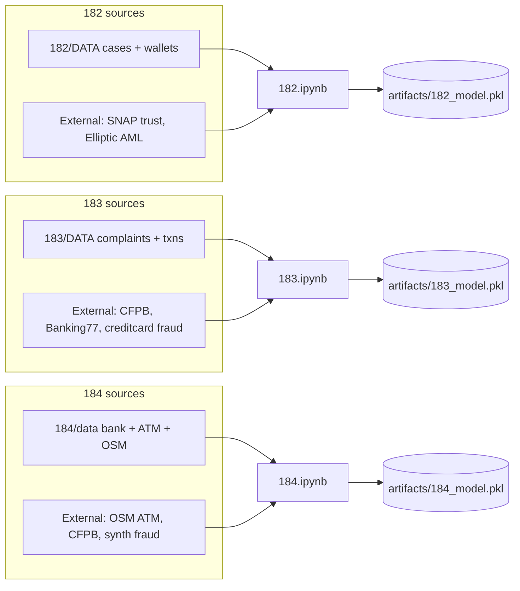
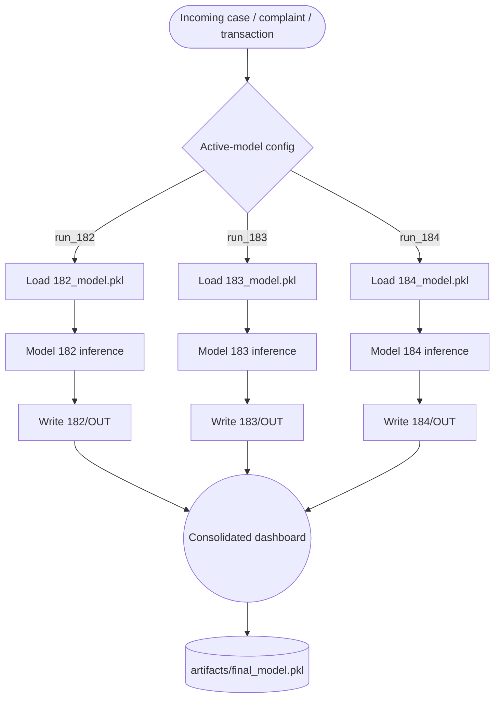
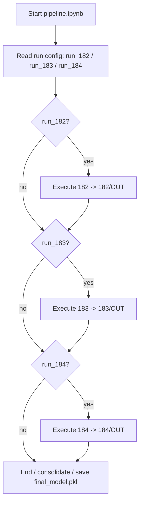

# Technical Roadmap — Modular Multi-Model Fraud-Intelligence Pipeline (Checklist Edition)

**Goal:** produce exactly **4 notebooks** and **4 model artifacts**:

| Notebook | Trains on | Produces |
|---|---|---|
| `182.ipynb` | 182/DATA (+ SNAP trust, Elliptic AML) | `artifacts/182_model.pkl` |
| `183.ipynb` | 183/DATA (+ CFPB, Banking77, creditcard fraud) | `artifacts/183_model.pkl` |
| `184.ipynb` | 184/data (+ OSM ATM, CFPB, synthetic financial fraud) | `artifacts/184_model.pkl` |
| `pipeline.ipynb` | loads the three artifacts above (subset-selectable) | `artifacts/final_model.pkl` + writes to `182/OUT`, `183/OUT`, `184/OUT` |

This document is the execution checklist. Check items off in order — later phases assume
earlier ones are done. Items are grouped by notebook so each can be worked (and tested)
independently before wiring `pipeline.ipynb`.

---

## 0. Shared Foundations (do this before opening any of the 4 notebooks)

- [ ] Create `lib/io_utils.py`
  - [ ] Loader for 182 JSON batch families (`cross_border_cases`, `crypto_investigation_cases`,
        `legal_requests`, `ransomware_cases`, `vasp_racking`, `vasp_responses`, `wallet_history`)
  - [ ] Loader for 183 JSON complaint/support/transaction families
  - [ ] Loader for 184 reference/synthetic banking + ATM JSON/CSV
  - [ ] Loader for each external corpus (SNAP CSV.gz, Elliptic CSV trio, CFPB CSV, Banking77
        CSV, creditcard.csv, OSM ATM GeoJSON, synthetic_financial_fraud)
  - [ ] Common `write_out(model_id, payload, slug)` → resolves `182/OUT` | `183/OUT` | `184/OUT`,
        writes atomically (temp file + rename), filename = `<slug>_<case_id>_<timestamp>_v<ver>.json`
- [ ] Create `lib/schema.py`
  - [ ] Define the canonical output contract shared by all 3 models:
        `{ risk_object, dashboard, routing_action_list, confidence, needs_review }`
  - [ ] Validate this shape against the existing hand-authored examples: `184/OUT/Full_report.json`,
        `183/OUT/Report_to_investigate.json`, `182/OUT/O1.json`
  - [ ] Write a `validate(payload) -> bool/raises` function used by `write_out`
- [ ] Create `lib/artifacts.py`
  - [ ] `save_model(obj, path)` / `load_model(path)` (pickle, with a version/hash header)
  - [ ] Standardize on **pickle** for v1 (per plan.md §5 open item — revisit ONNX/HF later)
- [ ] Create `config/run_config.yaml` matching the Config Contract in §4 below
- [ ] Decide and document label strategy (see §1.4/2.4/3.4 "Gap" notes) — this determines
      whether each notebook is genuinely supervised or weak-labeled

---

## 1. `182.ipynb` — Crypto / VASP / Cross-Border

### 1.1 Data ingestion
- [ ] Load all 7 sub-folders under `182/DATA/` (10–16 batches each) via `io_utils`
- [ ] Load `182/DATA/external/bitcoin_otc_trust.csv.gz` and `bitcoin_alpha_trust.csv.gz`
      (directed edges: source, target, rating ±1..10, time)
- [ ] Load `182/DATA/external/elliptic_aml/`: `elliptic_txs_features.csv` (166 features/txn),
      `elliptic_txs_edgelist.csv`, `elliptic_txs_classes.csv` (illicit/licit/unknown — **only
      real labels in this workstream**)

### 1.2 Feature engineering
- [ ] Build a unified wallet/transaction graph merging SNAP trust edges + Elliptic edgelist
- [ ] Node features from Elliptic `features.csv`
- [ ] Case-level features from `182/DATA` JSON (agency, countries_involved, wallet priority,
      case_type)

### 1.3 Labels
- [ ] Primary supervised signal: Elliptic `classes.csv` (illicit vs licit) for the
      fraud/clustering head
- [ ] Weak/derived labels for VASP-attribution head: mine `vasp_responses` (KYC/freeze outcomes)
      as a proxy target, flag as weak-label in metadata
- [ ] Document that `182/OUT/*.json` files are **format examples only, not a label set**
      (per data.md §4)

### 1.4 Modeling
- [ ] Graph clustering / GNN or classical classifier for illicit-wallet detection
- [ ] VASP-attribution head (which exchange/jurisdiction to route to)
- [ ] Cross-border routing head using `international_coordination` fields
- [ ] Confidence score attached to every prediction; below-threshold → `needs_review`

### 1.5 Evaluation
- [ ] Stratified train/val/test split on Elliptic-labeled subset
- [ ] Metrics: precision/recall/F1 (illicit detection), top-k accuracy (VASP attribution)
- [ ] Log dataset hash + generator/version info for reproducibility

### 1.6 Output
- [ ] Serialize pipeline (graph model + VASP head + preprocessing) to `artifacts/182_model.pkl`
- [ ] Emit one payload through `write_out(182, ...)` matching `schema.py` as a smoke test
- [ ] Confirm smoke-test output validates against `182/OUT/O1.json` shape

---

## 2. `183.ipynb` — Complaints / Support / Transactions

### 2.1 Data ingestion
- [ ] Load complaint families: `BM_type_generated.json`, `PHISING_generated.json`,
      `TBF_generated.json`, `TECH_issue_generated.json`
- [ ] Load support reference: `Labled_data_generated.json`, `Past_data_generated.json`,
      `Sahyoog_generated.json`, `Wallet_db_generated.json`
- [ ] Load transaction datasets: `BLOCK_chain_trnsdata_generated.json`, `BTC_trns_generated.json`,
      `tron_generated.json`
- [ ] Load `183/DATA/external/cfpb_complaints.csv.zip` → `complaints.csv` (real labeled
      narratives: product/sub-product/issue/resolution)
- [ ] Load `banking77_categories.json`, `banking77_train.csv` (10,003 rows),
      `banking77_test.csv` (3,080 rows) — 77-intent labels
- [ ] Load `creditcard_fraud/creditcard.csv` (284k labeled txns, PCA features + `Class`)

### 2.2 Feature engineering
- [ ] Text encoder (TF-IDF or sentence-embeddings) over complaint narratives
- [ ] Merge synthetic 183 complaint text with CFPB real complaint text for domain coverage
- [ ] Transaction features from creditcard.csv for the risk/alert head

### 2.3 Labels
- [ ] Complaint category head → supervised on CFPB product/sub-product/issue
- [ ] Intent head → supervised on Banking77 (77 classes)
- [ ] Risk/alert head → supervised on creditcard fraud `Class`
- [ ] Note: 183's own JSON complaints are synthetic/LLM-generated — treat as augmentation/
      domain-adaptation data, not primary label source (data.md §2.3 gap)

### 2.4 Modeling
- [ ] Multi-head model: category classifier, intent classifier, risk/alert classifier
- [ ] Confidence gating on all three heads

### 2.5 Evaluation
- [ ] Per-head precision/recall/F1 on held-out CFPB/Banking77/creditcard splits
- [ ] Cross-check synthetic-complaint predictions against real CFPB categories for realism drift

### 2.6 Output
- [ ] Serialize to `artifacts/183_model.pkl`
- [ ] Smoke-test `write_out(183, ...)` against `183/OUT/Report_to_investigate.json` shape

---

## 3. `184.ipynb` — Banking / ATM / Geospatial

### 3.1 Data ingestion
- [ ] Load reference data: `banks.json`, `cities.json`, `fraud_types.json`, `osm-atms/`
      (ahmedabad, bengaluru, delhi, gurugram, hyderabad, mumbai)
- [ ] Load synthetic banking: `account_registry.json`, `atm_withdrawal_links.json`,
      `bank_transactions.csv/.json`, `complaint_transaction_links.json`, `transaction_graph.json`
- [ ] Load synthetic complaints: `BM_C.json`, `complaint.json`, `complaint_account_registry.json`,
      `complaint_metadata.json`
- [ ] Load `data/synthetic/ATM.json`
- [ ] Load `184/data/external/atm_<city>.json` (live OSM ATM extracts, 6 cities)
- [ ] Load `184/data/external/` CFPB complaints (shared with 183) for the banking text layer
- [ ] Load `synthetic_financial_fraud/` (Kaggle, labeled fraud/non-fraud transfers)

### 3.2 Feature engineering
- [ ] Transaction-graph embeddings from `transaction_graph.json`
- [ ] Geospatial features: distance/clustering over OSM ATM coordinates per city
- [ ] Sequence features over `bank_transactions` for withdrawal-pattern modeling
- [ ] Fuse transaction-graph + geo + complaint-text features (per plan.md §3 "multi-modal fusion")

### 3.3 Labels
- [ ] Predicted withdrawal city/ATM head → supervised on historical `atm_withdrawal_links.json`
      + `synthetic_financial_fraud` labeled transfers
- [ ] Risk score / alert head → supervised on `synthetic_financial_fraud` `Class`-equivalent label
- [ ] Note: core 184 data is synthetic — external CFPB + synthetic_financial_fraud + live OSM
      provide the realism/label signal (data.md §3.3 gap)

### 3.4 Modeling
- [ ] Withdrawal-city/ATM predictor (hit-rate@k as primary metric)
- [ ] Risk score / alert classifier
- [ ] Confidence gating; below-threshold → `needs_review`

### 3.5 Evaluation
- [ ] hit-rate@k for predicted withdrawal city/ATM
- [ ] precision/recall/F1 for risk/alert head
- [ ] Held-out "challenge set" to catch synthetic-data overfitting (plan.md §3.5)

### 3.6 Output
- [ ] Serialize to `artifacts/184_model.pkl`
- [ ] Smoke-test `write_out(184, ...)` against `184/OUT/Full_report.json` shape

---

## 4. `pipeline.ipynb` — Modular Inference + Consolidation

### 4.1 Config contract (implement as a loaded dict/YAML)
```yaml
active_models:
  182: true     # crypto / VASP attribution + routing
  183: true     # complaint classification + risk/alert
  184: false    # banking / ATM predictive intelligence
input_source:  auto | 182 | 183 | 184
write_outputs: true
eval_mode:     false
```
- [ ] Implement config loader/validator

### 4.2 Router / dispatcher
- [ ] Lazy-load only the artifacts whose flag is `true`:
      `182_model.pkl`, `183_model.pkl`, `184_model.pkl`
- [ ] Dispatcher loop (pseudocode → real code):
  ```
  for mid in [182, 183, 184]:
      if not config.active_models[mid]: continue
      model = load_artifact(f"artifacts/{mid}_model.pkl")
      records = read_input(config.input_source, mid)
      results = model.predict(records)
      write_out(mid, normalize(results))   # -> <mid>/OUT/<slug>.json
  ```
- [ ] Each model's output normalized to the shared `schema.py` contract before writing

### 4.3 Error isolation
- [ ] One model failing (e.g., 184 geo-lookup timeout) does not block the others
- [ ] Failures logged and surfaced in `SUMMERY.txt`

### 4.4 Consolidation layer
- [ ] After per-model writes, merge active `182/OUT` + `183/OUT` + `184/OUT` payloads into a
      single consolidated dashboard/alert feed
- [ ] Cross-model signal fusion where overlapping case IDs exist (e.g., a 183 complaint linked
      to a 182 wallet or a 184 ATM withdrawal)

### 4.5 `final_model.pkl` — decide and build ONE of the following (pick before coding):
- [ ] **Option A (default): Pipeline artifact.** Bundle router config + references to the three
      loaded sub-models + schema/writer into one object, so `final_model.pkl` alone can be
      loaded elsewhere to run the full subset-selectable pipeline end-to-end.
- [ ] **Option B: Ensemble meta-model.** Train a lightweight meta-learner (e.g., logistic
      regression/gradient boosting) over the three models' risk scores + confidences to produce
      one final consolidated risk score. Requires overlapping-case labeled data across
      workstreams — check availability before committing to this option.
- [ ] Record the chosen option and rationale at the top of `pipeline.ipynb`
- [ ] Serialize to `artifacts/final_model.pkl`

### 4.6 Evaluation mode
- [ ] `eval_mode: true` scores outputs against held-out labeled slices from each workstream
      (Elliptic / CFPB+Banking77+creditcard / synthetic_financial_fraud)
- [ ] Emit per-model + consolidated accuracy/recall/F1 report

---

## 5. Architecture Diagrams

### 5.1 Training view (three notebooks → artifacts)


### 5.2 Pipeline / inference view (modular, subset-selectable)


### 5.3 Conditional execution logic


---

## 6. Cross-Cutting Accuracy Strategies (apply inside every notebook)

- [ ] **Label leverage** — anchor supervision on Elliptic / CFPB / Banking77 / creditcard fraud /
      synthetic_financial_fraud; derive weak labels for the unlabeled source JSONs
- [ ] **Multi-modal fusion** — combine tabular + graph + text features per model
- [ ] **Confidence gating + human-in-the-loop** — `needs_review` flag below threshold
- [ ] **Ensemble & calibration** — calibrate probabilities; ensemble heads where signals overlap
- [ ] **Strict evaluation protocol** — stratified splits, per-task metrics, held-out challenge set
- [ ] **Bias / realism guard** — validate synthetic-trained heads against real external corpora
- [ ] **Reproducibility** — pin generator scripts (184 `scripts/`) + dataset versions; log hashes

---

## 7. Efficient Data Flow to Output Folders

- [ ] Single writer abstraction (`write_out`) resolves folder, validates schema, writes atomically
- [ ] Idempotent, versioned output filenames (case id + timestamp + model version)
- [ ] Lazy model loading — only `true`-flagged artifacts load
- [ ] Cached external calls (blockchain/OSM/CFPB enrichment) on disk
- [ ] Consolidation layer merges the three `OUT` folders into one dashboard/alert feed
- [ ] Error isolation — one model's failure doesn't block the others; logged to `SUMMERY.txt`

---

## 8. Final Deliverable Checklist

- [ ] `182.ipynb` runs standalone → produces `artifacts/182_model.pkl`
- [ ] `183.ipynb` runs standalone → produces `artifacts/183_model.pkl`
- [ ] `184.ipynb` runs standalone → produces `artifacts/184_model.pkl`
- [ ] `pipeline.ipynb` runs with any subset of `active_models` true/false and still succeeds
- [ ] `pipeline.ipynb` writes normalized JSON into the correct `182/OUT`, `183/OUT`, `184/OUT`
- [ ] `pipeline.ipynb` produces `artifacts/final_model.pkl` (Option A or B from §4.5)
- [ ] `eval_mode: true` produces a metrics report without breaking normal runs
- [ ] All 4 notebooks + `lib/` + `config/` + `artifacts/` committed; `*/DATA/external` and
      `*/data/external` remain git-ignored (regenerated by fetch notebooks)

---

## 9. Open Items Still Needing a Decision (carried over from original plan.md)

- **Output contract v1**: final sign-off on the exact shared JSON schema (`schema.py`)
- **`final_model.pkl` semantics**: Option A (pipeline bundle) vs Option B (trained ensemble
  meta-model) — see §4.5, decide before writing `pipeline.ipynb`
- **Model packaging**: pickle (default for v1) vs ONNX vs HF transformers
- **Threshold policy**: default confidence cut-offs per action type (freeze vs alert vs log)
- **Scale target**: expected peak input volume → batching vs streaming inference
- **Feedback loop**: how operator corrections become new labels for the next training pass